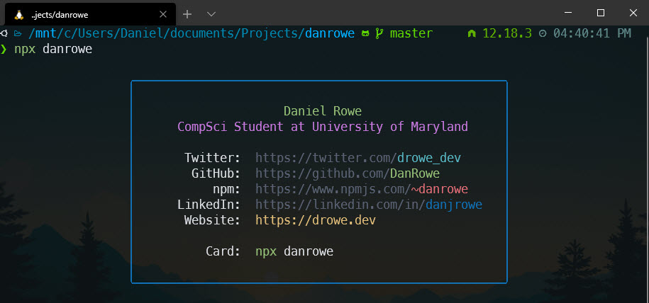

# Npx Business Card



My Npx business card to connect with me through the terminal.

## Usage

Full Card

```sh
npx danrowe
```

JSON Card

```sh
npx danrowe -j
```

------

## Create Your Own

Check out this [article](https://studioelsa.se/blog/open-source-oss-npx-business-card/) to understand how creating the cli tool in node works.

Then check out this [dev.to article](https://dev.to/wuz/setting-up-a-npx-username-card-1pip) which uses [bitandbang's repo](https://github.com/bnb/bitandbang/blob/master/build.js) for some advanced styling using [chalk](https://www.npmjs.com/package/chalk).
